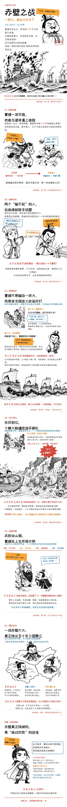

# pic-flow：让 AI Agent 帮你画"半小时漫画"式科普长图

pic-flow 是一个 AI Agent 技能（Skill）。装好之后，你只需对 agent 说一句
**"用 pic-flow 做一张 XX 长图"**，它会先和你确认形式与画风，再自动走完
**AI 生图素材 → 程序排版 → LLM 识图校准 → 填字 → 拼接** 全流程，
产出一张 1080px 宽、7000~14000px 高、可以直接发公众号 / 小红书的长图。

成品长这样（仓库自带示例 `examples/chibi/赤壁之战_长图.jpg`）：

<p align="center">
  
</p>

## 为什么需要它

直接让 AI"生成一张长图"行不通：单次生图分辨率有限、画不下 7000px、中文文字必崩。
pic-flow 把活拆成三步：

1. **AI 只画无文字素材**（人物、场景、插画），画风统一、单图可重试；
2. **程序排版引擎逐块渲染**文字、气泡、图表、布局，像素级可控；
3. **LLM 识图检查每一块**（带网格坐标的 debug 画布），发现碰撞 / 越界 / 断行就修完再渲染，
   形成"生成 → 检查 → 修复"的质量闭环，而不是生成完碰运气。

## 核心特性

- **三维选型，按需定制**：8 内容模板（故事 / 教育 / 操作指引 / 资讯 / 数据报告 /
  测评对比 / 盘点清单 / 人物志）× 9 布局（故事流 / 时间线 / 卡片流 / 看板 / 指标看板 /
  对比 / 排行榜 / 流程图 / 金句卡，可混用）× 8 画风（黑白手绘 / 彩色手绘 / 矢量扁平 /
  杂志 / 国潮 / 深色科技 / 手账可爱 / 简报纸质）。
- **新手引导**：不懂这些概念也没关系——agent 会按你的需求先给出"模板 × 布局 × 画风"
  推荐组合（附理由和备选），你确认后才开工。
- **中文排版讲究**：自动换行（避头点、英文不拆词）、三种语义高亮（关键词橙 / 引语蓝 /
  强信息红）、八种气泡形态、语义化配色；内置 OFL 开源中文字体（霞鹜文楷 /
  站酷快乐体 / 马善政毛笔楷书）。
- **生图可靠**：多上游自动切换、断点续跑、失败自动降级尺寸；白底素材自动转透明 + 裁边。
- **可扩展**：新增画风 = 加一个 `styles/*.json` 风格包，零代码。

## 安装

把它克隆进你正在用的 agent 的技能目录（任选其一）。运行环境需要
Python 3.8+、Pillow、numpy；生图功能另需能访问 OpenAI Images 兼容接口（见下文）。

**Claude Code**（个人技能装到 `~/.claude/skills/`，或放项目的 `.claude/skills/` 仅对该项目生效）

```bash
mkdir -p ~/.claude/skills
git clone https://github.com/liujuntao123/pic-flow.git ~/.claude/skills/pic-flow
```

**Codex CLI**（技能目录为 `$CODEX_HOME/skills/`，默认 `~/.codex/skills/`）

```bash
mkdir -p ~/.codex/skills
git clone https://github.com/liujuntao123/pic-flow.git ~/.codex/skills/pic-flow
```

如果已启用内置的 skill-installer 技能，也可以直接对 Codex 说：
*"Install the pic-flow skill from the GitHub repo liujuntao123/pic-flow"*。

**workbuddy（DeepSeek Harness）**（技能目录为 `~/.dsh/skills/`）

```bash
mkdir -p ~/.dsh/skills
git clone https://github.com/liujuntao123/pic-flow.git ~/.dsh/skills/pic-flow
```

装完新开一个会话即可被自动发现。

## 如何使用

### 方式一：一句话交给 agent（推荐）

对 agent 描述需求即可，例如：

- "用 pic-flow 做一张赤壁之战的科普长图"
- "用 pic-flow 把这份年报做成一图读懂，深色科技风"
- "再做一张像赤壁之战那样的长图，主题是安史之乱"

agent 会先给一张**选型选择卡**——推荐组合 + 最多两个备选 + 一句理由，例如：

> **推荐**：story 故事 × story-flow × bw-sketch 黑白手绘 —— 历史叙事成熟组合
> 备选 A：guochao 国潮古风 —— 传统题材想要更浓的东方视觉
> 备选 B：magazine 杂志 —— 文字量大、走深度专题

回复"好"按推荐开工，或回复编号 / 单独改一项（"画风换 dark"）。之后 agent 按流程产出
分镜、素材、逐块排版校准，成品输出到项目目录 `output/`。过程中随时可以插话调整，
比如"篇幅压到 6 块""受众是小学生"。

### 方式二：手动命令行（不经过 agent 也能跑）

```bash
# 1) 脚手架：生成项目目录（流水线脚本 + 字体软链 + 内容骨架 + 风格包）
python3 pipeline/new_project.py ~/workspace/my-topic --title "主题" \
    --template edu --style vector-flat --layout flow-steps
cd ~/workspace/my-topic

# 2) 生图（可选，素材也可自备）：多上游容错、断点续跑
python3 scripts/gen_all.py

# 3) 白底素材转透明 + 裁边（深底素材跳过）
python3 scripts/make_transparent.py assets/*.png

# 4) 排版：编辑 layout/blockN.json，机检 → 调试渲染 → 识图校准 → 正式渲染
python3 scripts/layout_lint.py layout/block1.json                           # 渲染前机检
python3 scripts/compose.py layout/block1.json -o blocks/stage1.png --debug  # 调试画布
python3 scripts/compose.py layout/block1.json -o blocks/final1.png          # 正式渲染

# 5) 拼接成品（JPG + 550px 宽预览）
python3 scripts/stitch.py output/out.jpg blocks/final1.png blocks/final2.png
```

校准循环：看 `stage1.png`（自带 100px 网格坐标与元素包围盒）→ 改 `layout/block1.json`
→ 复渲，直到无碰撞、不断行、关系正确。

### 生图上游配置

`pipeline/genlib.py` 的 `PROVIDERS` 内置了一条 OpenAI Images 兼容上游链（按序重试，
模型 `gpt-image-2`）。自托管时把 `base` / `key` 换成你自己的中转或官方 API 即可；
不生图也能用——排版、图表、拼接全部离线可用，素材自备。

## 更多示例

| 示例 | 选型 | 位置 |
|---|---|---|
| 赤壁之战（半小时漫画风历史科普） | story × story-flow × bw-sketch | `examples/chibi/` |
| 水循环（教育讲解，多布局混用） | edu × info-feed/event-flow × vector-flat | `projects/water-cycle/` |

## 目录

| 目录 | 内容 |
|---|---|
| `pipeline/` | 排版引擎、生图链、脚手架、机检与合规校验脚本 |
| `templates/` | 8 种内容模板（block 骨架表 + 口吻 + 高度预算） |
| `layouts/` | 9 种布局骨架（可直接拷进项目改） |
| `styles/` | 8 种风格包（生图画风后缀 + 排版主题） |
| `references/` | 设计系统详解、设计方法、素材 prompt 指南 |
| `examples/` | 赤壁之战示例 + 成品图 |
| `projects/` | 完整实战项目（水循环） |
| `fonts/` | OFL 开源中文字体（霞鹜文楷 / 站酷快乐体 / 马善政毛笔楷书） |

skill 的完整工作指引（选型引导、识图校准 SOP、设计方法、常见坑）见 [SKILL.md](SKILL.md)。
