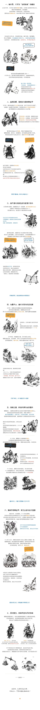

# pic-flow：黑白手绘叙事与科普长图流水线

pic-flow 是一个专为长篇叙事与深度科普打造的 AI Agent 技能（Skill）。
通过 **素材生成 → 声明式程序排版 → 机器检查与视觉审查 → 无缝拼接** 全流程，
默认支持 1080px 单栏的大画布长图；实际宽度、块数和总高度按发布平台、内容类型与信息密度调整。

整条流水线建立在一个分工上：**模型只负责画插画，版式与文字归排版引擎**。
由此推出两条贯穿全篇的法则：

- **去容器化画卷**：长图是一卷连续的纸，画面里任何元素都不该声明自己的边界。
  这条法则**同时管文字与图形两侧**——文字不套卡片框，插图也不许自带方框。
- **素材逐块四图**：一个 block 一次生图出 4 张插画，切开后交给排版引擎。
  省生图次数、块内笔触天然统一；只有需要 980~1080px 满铺的全幅大场景才另走单张。

成品参考（仓库自带的历史叙事示例，仅用于展示一种题材与排版实现）：

<p align="center">
  
</p>

## 为什么需要它

直接让 AI 生成长图存在三大痛点：单次分辨率受限、无法承受万像素纵深、文字渲染必崩。
pic-flow 将流水线严格解耦为可控节点：

1. **AI 专注画无文字透明背景的插画**：**一个 block 一次生图出 4 张插画**（2×2 网格 → 自动切开），
   严格执行开放式构图约束，主体辨识度高、块内笔触天然统一；
2. **声明式排版引擎像素级排版**：自研文本换行、避头尾、字阶混排与带角度定向气泡几何算法；
3. **机检链 + 双代理对抗闭环质检**：素材侧（方图感）与排版侧（碰撞/遮挡/净空）各一组机器判据全绿后，
   生成代理与独立挑剔评审代理对抗，执行中心压缩打分与像素级穿刺排查。

## 核心特性

- **默认主题组合**：以 **story（故事叙事） × story-flow（情节流动） × bw-sketch（黑白手绘）** 为默认方案，适合事件叙事、机制解释、商业复盘与深度科普；流程中的素材、排版和检查能力也可被其他视觉主题与内容结构复用。
- **逐块四图生图**：一个 block 一次生图 = 4 张插画，切开即用。生图次数降到 1/4，且同块四图出自同一张画稿、线条与墨色不会有差异；角色特征三元组以 `{占位符}` 在每个格子逐字展开，跨格形象靠"一字不差的重复"锚定。
- **开放式构图约束**：把"插图要落在白纸上、不是贴在白纸上"写进提示词——背景全留白、不写包围式布景、不画贯穿画面的地面线、四周墨迹由密到疏自然消散。配 `check_edges.py` 量化验收（硬边数趋近 0）。
- **机检链 + 双代理对抗质检闭环**：素材侧查方图感与透明标准化，排版侧查碰撞、越界、真实字体折行、像素级遮挡与净空；随后排版代理与独立评审代理对抗，实现绝对零遮挡、主体锚定与跨领域道具防错置。
- **空间与层级排版**：默认采用去容器化画卷（文字不滥套卡片、插图避免无意形成硬边），并按内容密度设置视觉面积、图文间距和留白；具体数值由主题包与项目目标确定。
- **中文排版讲究**：自动换行（避头点、英文不拆词）、三种语义高亮（关键词橙 / 引语蓝 / 强信息红）、八种气泡形态、语义化配色；内置 OFL 开源中文字体（霞鹜文楷 / 站酷快乐体 / 马善政毛笔楷书）。
- **生图可靠与断点续跑**：多上游自动切换、失败降级、断点续跑；生图自带透明背景与防御性 Prompt 约束。

## 安装

把它克隆进你正在用的 agent 的技能目录（任选其一）。运行环境需要
Python 3.8+、Pillow、numpy；**生图功能需配置你自己的 OpenAI Images 兼容
Provider**（见下文「生图 Provider 配置」，skill 不内置任何 Key），不生图可跳过。

**Claude Code**（个人技能装到 `~/.claude/skills/`，或放项目的 `.claude/skills/` 仅对该项目生效）

```bash
mkdir -p ~/.claude/skills
git clone https://github.com/liujuntao123/pic-flow.git ~/.claude/skills/pic-flow
```

**Codex CLI**（技能目录为 `$CODEX_HOME/skills/`，默认 `~/.codex/skills/`）

```bash
mkdir -p ~/.codex/skills
git clone https://github.com/liujuntao123/pic-flow.git ~/.codex/skills/pic-flow
```

**workbuddy（DeepSeek Harness）**（技能目录为 `~/.dsh/skills/`）

```bash
mkdir -p ~/.dsh/skills
git clone https://github.com/liujuntao123/pic-flow.git ~/.dsh/skills/pic-flow
```

装完新开一个会话即可被自动发现。

## 如何使用

### 方式一：一句话交给 agent（推荐）

对 agent 描述需求主题即可（涵盖历史事件、科学原理解析、商业案例复盘或重大议题深度科普）。

agent 会快速提炼核心冲突与演进脉络、梳理主角特征，确认篇幅后直接开工，产出分镜、素材、逐块排版与双代理闭环校准，成品输出到项目目录 `output/`。

### 方式二：手动命令行（不经过 agent 也能跑）

```bash
# 1) 脚手架：生成项目目录（脚本与字体软链 + 默认 story × story-flow × bw-sketch 骨架）
python3 pipeline/new_project.py ~/pic-flow-projects/my-topic --title "主题"
cd ~/pic-flow-projects/my-topic

# 2) 生图：逐块四图（默认路线）——一个 block 一次生图出 4 张插画，自动切开
python3 scripts/gen_sheets.py                    # 断点续跑；--only sheetBlock1 / --force / --spec
#    仅需满铺的全幅大场景才走单张：
python3 scripts/gen_all.py                       # 读 assets.json

# 3) 素材标准化 + 素材侧机检
python3 scripts/make_transparent.py assets/*.png # 白底→透明 + 灰雾清理 + 紧致裁边（必须在机检前跑）
python3 scripts/check_edges.py assets/*.png              # 查方图感：硬边数应趋近 0

# 4) 排版：编辑 layout/blockN.json → 机检链 → 双代理对抗审查 → 正式渲染
python3 scripts/layout_lint.py    layout/block1.json   # 碰撞/越界/居中滥用（hard 必须 = 0）
python3 scripts/check_geom.py             layout/block1.json   # 真实字体度量：折行/孤行/插图带高
python3 scripts/check_occlusion.py        layout/block1.json   # 气泡与素材墨迹压盖 0 px
python3 scripts/check_clearance.py        layout/block1.json   # 画布口径净空 ≥40px
python3 scripts/compose.py layout/block1.json -o blocks/stage1.png --debug  # 调试画布
python3 scripts/compose.py layout/block1.json -o blocks/final1.png          # 正式渲染

# 5) 拼接成品长图
python3 scripts/stitch.py output/out.jpg blocks/final*.png
```

校准循环：看 `stage1.png`（自带 100px 网格坐标与元素包围盒）→ 改 `layout/block1.json`
→ 复渲，直到无碰撞、不断行、关系正确。

**项目目录与产物位置**：项目统一创建在 `~/pic-flow-projects/<项目名>/`；用户不需要预先创建 `pic-flow-projects/`，`new_project.py` 会自动创建父目录。每个项目自包含，最终交付只认该项目下的 `output/`：

| 路径 | 性质 | 内容 |
|---|---|---|
| `output/` | **产物（成品）** | 拼接后的长图 JPG + 550px 宽预览，唯一需要交付与发布的产物 |
| `blocks/` | 产物（中间） | 每块渲染图：`stage*` 调试画布、`final*` 正式块 |
| `assets/` | 产物（中间） | 切开/生成后的透明背景插画，`gen_sheets.py` 可断点续跑再生 |
| `sheets/` | 产物（中间） | 精灵图原图与 `*_slice_debug.png` 切割调试图，备查切分是否伤到内容 |
| `storyboard.json`、`sheets.json`、`assets.json`、`layout/blockN.json`、`style.json`、`CONTENT.md` | **源文件** | 分镜、逐块四图规格、单张素材清单、排版描述、风格包、内容骨架——真正值得入 git 的工程源文件 |

产物均可由脚本再生，是否入 git 由你自己的项目仓库决定；仓库自带标杆范例工程在 `examples/` 目录下。

**脚本与字体都是软链，不是副本**：脚手架把 `scripts/` 与 `fonts/` 软链到 skill
本体，因此项目里的脚本永远等于 skill 当前版本，不会各自漂移。副作用是脚本也能
原地运行——项目里不必有副本：

```bash
python3 <skill>/pipeline/compose.py <项目>/layout/block1.json -o out.png
PICFLOW_ROOT=<项目> python3 <skill>/pipeline/compose.py layout/block1.json -o out.png
```

项目根由「被操作的 layout 文件」逐级上溯自动推断（找 `assets.json` / `style.json` /
`layout/` 等标志），无需把脚本复制进项目；个别场景可用 `PICFLOW_ROOT` 显式指定。

### 两套排版引擎（Python / Canvas），同一份 layout

排版与机检有两条**并存**的实现，读**同一份 `layout/blockN.json`**、遵守**同一套判据**、
产出**同一批产物**，可以逐块互换：

| | Python 线 | Canvas 线 |
|---|---|---|
| 渲染 | `pipeline/compose.py` | `pipeline/canvas/render.mjs` |
| 机检 | `layout_lint.py` · `check_geom.py` · `check_occlusion.py` · `check_clearance.py` | `pipeline/canvas/checks/{lint,geom,occlusion,clearance}.mjs` |
| 拼接 | `pipeline/stitch.py` | `pipeline/canvas/stitch.mjs` |
| 依赖 | Pillow + numpy | Node 18+ 与 `npm install`（预编译 Skia 绑定 `@napi-rs/canvas`） |
| 额外能力 | —— | `preview.mjs` 便携逐块复核 · `parity.mjs` 双引擎逐像素对照 · `render.mjs --scale 2` 超采样出图 |

```bash
cd <skill 根> && npm install            # 只装一个预编译依赖
node pipeline/canvas/render.mjs layout/block1.json -o blocks/final1.png
node pipeline/canvas/checks/lint.mjs layout/block*.json
node pipeline/canvas/stitch.mjs output/长图.jpg blocks/final*.png
```

脚手架会把 `scripts/canvas` 软链到 `pipeline/canvas`，项目内直接写
`node scripts/canvas/render.mjs …` 即可。切到 Canvas 线**不需要改任何一个 layout 文件**；
细节、两引擎差异与踩坑记录见 `pipeline/canvas/README.md` 与 `SCHEMA.md`。

### 生图 Provider 配置（用户自备）

skill **不内置任何 API Key**。生图需要一个 OpenAI Images 兼容接口
（`POST {base}/images/generations`，官方 API 或任意中转均可），两种配法任选其一。
配置只存在你机器上，不会进仓库：

**方式一：环境变量（单个上游）**

```bash
export PICFLOW_IMAGE_BASE="https://api.openai.com/v1"
export PICFLOW_IMAGE_KEY="sk-..."
# 可选：export PICFLOW_IMAGE_MODEL="gpt-image-2"
```

**方式二：配置文件（推荐，多个上游按序容错）**

```bash
mkdir -p ~/.config/pic-flow
cp pipeline/providers.example.json ~/.config/pic-flow/providers.json
$EDITOR ~/.config/pic-flow/providers.json   # 填入你自己的 base 与 key
```

```json
{
  "model": "gpt-image-2",
  "providers": [
    { "name": "main",   "base": "https://api.openai.com/v1",       "key": "sk-...", "fmt": "b64_json" },
    { "name": "backup", "base": "https://你的中转.example.com/v1", "key": "sk-...", "fmt": "url" }
  ]
}
```

`fmt` 可省略（默认 `b64_json`）；部分中转只认 `"url"` 回包时改为 `"url"`。
模型默认 `gpt-image-2`，可用 `PICFLOW_IMAGE_MODEL` 或配置里的 `"model"` 覆盖。
未配置就跑生图脚本时，会打印上述配置引导。不生图也能用——排版、图表、
拼接全部离线可用，素材自备。

## 官方标杆案例

| 示例 | 选型体系 | 位置与工程 |
|---|---|---|
| 《血菊残，大唐笑容已泛黄：黄巢起义始末》（1080 × 18780px） | 历史讲述（story × story-flow × bw-sketch） | 全套工程源码与成品：`examples/huangchao-tang-collapse/` |
| 《为什么古人相信水银能炼出长生不老药？》（1080 × 18760px） | 知识科普（story × story-flow × bw-sketch） | 全套工程源码与成品：`examples/alchemy-mercury/` |

官方示例库收录了历史讲述与知识科普两大题材的工业级实战范例，遵循去卡片化画卷感、零遮挡排版与全套机器质检链（hard=0、压盖 0px、净空 ≥40px）。其完整保留了分镜规划（`storyboard.json`）、逐块四图素材与生成清单（`sheets.json`、`assets/`）、声明式排版布局（`layout/`）以及高清成品长图与移动端缩略图，可逐字节高精复现。

## 目录结构

| 目录 | 内容 |
|---|---|
| `pipeline/` | 生图线（`gen_sheets.py` 逐块四图 / `slice_sheet.py` 切分 / `gen_all.py` 单张 / `check_edges.py` 方图感机检）、排版线（`compose.py` 渲染引擎 / `layout_lint.py` · `check_geom.py` · `check_occlusion.py` · `check_clearance.py` 机检链 / `stitch.py` 拼接）、`new_project.py` 脚手架 |
| `templates/` | 核心模板（`story.md` 内容骨架 + `storyboard.json` 分镜定义 + `sheets.json` 逐块四图规格） |
| `layouts/` | 核心故事流布局骨架（`story-flow.json`） |
| `styles/` | 官方黑白手绘风格包（`bw-sketch.json` 粗黑钢笔墨线 + 橙蓝红文字系统） |
| `references/` | 设计系统详解（`style-guide.md`）、设计方法（`design-principles.md`）、内容质量（`content-quality.md`）、Prompt 指南（`asset-prompts.md`） |
| `examples/` | 官方实战工程与高清长图成品库（`huangchao-tang-collapse/` · `alchemy-mercury/`） |
| `fonts/` | OFL 开源中文字体（霞鹜文楷 / 站酷快乐体 / 马善政毛笔楷书） |

skill 的完整工作指引见 [SKILL.md](SKILL.md)。
